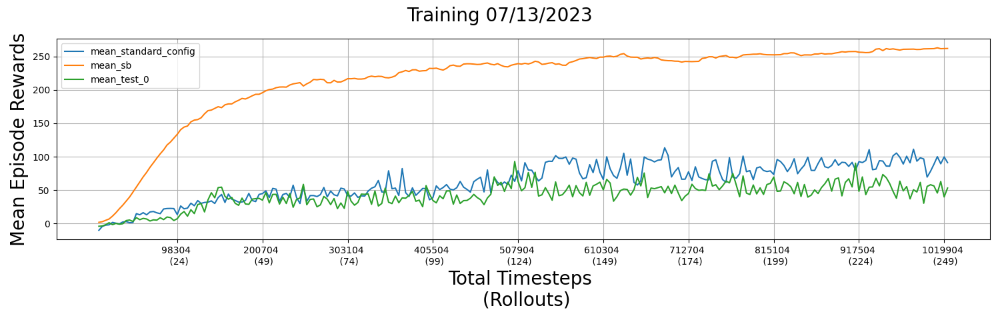

# 3 Weights Without Biases - "Autonome Systeme Praktikum" at LMU summer-term 2023

This project aims to implement an agent using [Proximal Policy Optimization (PPO)](https://doi.org/10.48550/arXiv.1707.06347). And given the Unity environment of
the ["Karting Microgame"](https://learn.unity.com/project/karting-template), it can be used to train a robust agent on multiple tracks which can compete against other
groups/implementations.

## Authors

Zora Wurm,
Max Erler,
Sophia Schubert

## Prerequisites

- [Python 3.9.5](https://www.python.org/downloads/release/python-395/) `conda create -n asp23 python=3.9.5`
- [Miniconda 23.3.1](https://docs.conda.io/en/latest/miniconda.html) `conda update conda`
- [Visual Studio Code](https://code.visualstudio.com/) (optional, also possible with any other Editor or IDE)
- [Karting Challenge](https://gitlab.lrz.de/mobile-ifi/asp/SoSe23/karting-challenge) (optional, builds are in the
  repository)

## Project structure

### Packages

#### `karting_challenge_experiment`

This package provides functionalities to conduct highly configurable and verifiable experiments with the
`karting_challenge_rl` package (see below). Usage like in `scripts/run_experiment.py` script.

#### `karting_challenge_rl`

This package provides functionalities to learn reinforcement learning agents in
preconfigured [Unity Karting Microgame](https://learn.unity.com/project/karting-template) tracks as environments.
Currently, this only includes our own reimplementation of [PPO](https://doi.org/10.48550/arXiv.1707.06347), the 
implementation of [PPO of stable-baselines3](https://stable-baselines3.readthedocs.io/en/master/modules/ppo.html) and 
a randomly acting agent for comparison reasons.

Due to the high extensibility of our package, other natively implemented or pre-implemented reinforcement learning
algorithms can be easily added. Also, other environments can be integrated to compare the algorithms' performances 
cross-environmental.

### Scripts

#### `scripts/run_experiment.py`

This script is used to conduct experiments with the `karting_challenge_experiment` package (see below for usage).

#### `scripts/compare_plotter.py`

This script is used to create means of multiple experiment results, e.g. to evaluate a specific configuration across
multiple seeds (see below for usage). Moreover, it is used to create comparison plots of multiple experiment results.

## Functionalities / Features

The  project provides the following features for conducting experiments:

| Nr. | Feature                                                                       | Sample Config                                                                     | How to use                                                    |
|-----|-------------------------------------------------------------------------------|-----------------------------------------------------------------------------------|---------------------------------------------------------------|
| 1   | Training `PPO` from scratch + results plotting                                | `./configs/sample-config-train-PPO.yml`                                           | see **Experiment Configuration** and **Experiment Execution** |
| 2   | Training `PPO` with pre-trained model weights + results plotting              | `./configs/sample-config-retrain-PPO.yml`                                         | see **Experiment Configuration** and **Experiment Execution** |
| 3   | Evaluating a pre-trained `PPO` model + results plotting                       | `./configs/sample-config-eval-PPO.yml`                                            | see **Experiment Configuration** and **Experiment Execution** |
| 4   | Training `PPO-sb3` from scratch + results plotting                            | `./configs/sample-config-train-PPO-sb3.yml`                                       | see **Experiment Configuration** and **Experiment Execution** |
| 5   | Training `PPO-sb3` with pre-trained model weights + results plotting          | `./configs/sample-config-retrain-PPO-sb3.yml`                                     | see **Experiment Configuration** and **Experiment Execution** |
| 6   | Evaluating a pre-trained `PPO-sb3` model                                      | `./configs/sample-config-eval-PPO-sb3.yml`                                        | see **Experiment Configuration** and **Experiment Execution** |
| 7   | Collecting "training" data of a `random` agent  + results plotting            | `./configs/sample-config-random.yml`                                              | see **Experiment Configuration** and **Experiment Execution** |
| 8   | Create averaged results of multiple experiment results (e.g. different seeds) | no initial config needed, just experiment results                                 | see **Experiment Comparison**                                 |
| 9   | Plot results of multiple experiments in one figure                            | no initial config needed, just experiment results and optionally averaged results | see **Experiment Comparison**                                 |

`PPO` := our PPO implementation<br>
`PPO-sb3` := stable-baselines3 PPO implementation<br>
`random` := random agent / choice

## How to use

### Requirements / Setup

Meet the requirements described in the prerequisites above.
Create a new conda environment with environment.yml to have the correct versions of used packages.

```bash
conda env create -f environment.yml
```

### Experiment Configuration

All parts of the following 'sample' config can be adjusted.

```yaml
mode: train # (train / eval)
logger:
  level: 20 # CRITICAL = 50, ERROR = 40, WARNING = 30, INFO = 20, DEBUG = 10, NOTSET = 0
  format: "%(asctime)s - %(levelname)s - %(module)s - %(message)s"
experiment_path: ./experiments/my-sunny-sunday-experiments

# define environment
environment:
  # modifications of track
  tracks_base_path: ./builds/training/KartingChallenge
  track_ids: [ 0, 1, 2, 3 ] # random / 1 / 2 / ... / n --> list [1, 66, 500], or single one 1
  seed: 42
  time_scale: 10 # <= 10 due to physics engine of unity

# define the rl agent (using the above environment)
agent:
  train_rollouts: 250 # the number of total training timesteps is calculated as follows: # train_rollouts * # n_steps
  log_interval: 10 # (in rollouts) only refers to logging to the console
  save_model_interval: 10 # (in rollouts) refers to saving .pt and .onnx files of the model(s)
  save_stats_interval: 10 # (in rollouts) refers to saving .json files with the rollout data

  eval_interval: 50 # (in rollouts) refers to testing the trained model without updating the gradients
  eval_rollouts: 10 # the number of total evaluation timesteps is calculated as follows: # eval_rollouts * # n_steps

  # define model with its specific parameters
  model:
    name: PPO # our PPO implementation
    device: auto # (cuda / cpu / auto)
    parameters:
      additional_learnable_actions: [ "acceleration", "breaking" ] # "steering" is always learned, "acceleration" or "breaking" can be additionally learned (empty list or None if only "steering is the goal")
      cov_mat_diag: 2.0 # FLOAT!!!
      cov_decay_mechanism: exp # lin or exp or static
      cov_decay_rate: 0.01
      cov_end_val: 0.000001
      policy: MlpPolicy
      learning_rate: 0.0003 # reference value from sb3
      gamma: 0.99 # reference value from sb3
      n_steps: 4096 # max number of timesteps of an episode (reference value from tutors and sb3)
      n_epochs: 20 # number of backward passes per update (reference value from sb3)
      obs_size: 48 # vector size of an observation / state
      hidden_dim: 64 # size of hidden dimension
      clip_range: 0.4 # clipping of the policy / actor loss (reference value from sb3)
      pretrained_path: # empty if start from scratch
```

A config-YAML can be chosen from the configs-folder.

### Experiment Execution

```bash
# general syntax
python scripts/run_experiment.py --conf configs/<CONFIG-NAME>.yml

# example
python scripts/run_experiment.py --conf configs/sample-config-train-PPO.yml
```

### Experiment Comparison

```bash
# general syntax
python scripts/compare_plotter.py [--create_mean] --conf_paths {<CONFIG-PATH>} --file_name <FILE_NAME>

# example to create a mean of the experiment results associated with the given configuration paths
python scripts/compare_plotter.py --create_mean --conf_paths "./experiment-results/improvement-experiments/exp-7/2023-07-03-22-50-26/sample-config-train-PPO-seed-42-cov_decay_rate-0.001.yml" "./experiment-results/improvement-experiments/exp-9/2023-07-04-06-18-56/sample-config-train-PPO-seed-100-cov_decay_rate-0.001.yml" "./experiment-results/improvement-experiments/exp-11/2023-07-04-18-26-39/sample-config-train-PPO-seed-200-cov_decay_rate-0.001.yml" --file_name "averaged-exp7-exp9-exp11"

# example to create a comparison plot of the before averaged results with our best config
python scripts/compare_plotter.py --conf_paths "./scripts/mean_standard_config.csv" "./scripts/mean_averaged-exp7-exp9-exp11.csv" --file_name "comparison-mean-exp7-exp9-exp11-with-best"
```

#### Example Output



## Related Work

[John Schulman, Filip Wolski, Prafulla Dhariwal, Alec Radford, Oleg Klimov – Proximal Policy Optimization Algorithms](https://doi.org/10.48550/arXiv.1707.06347)
